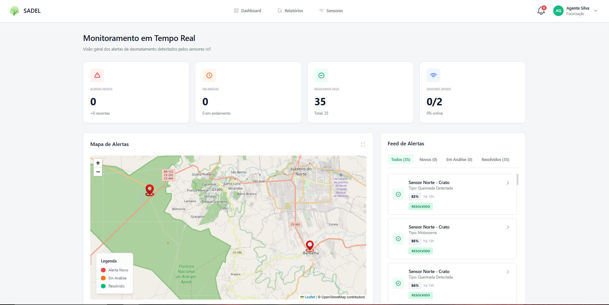
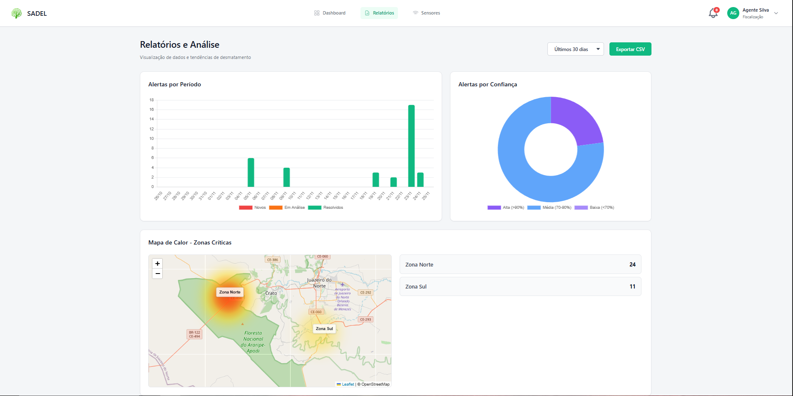
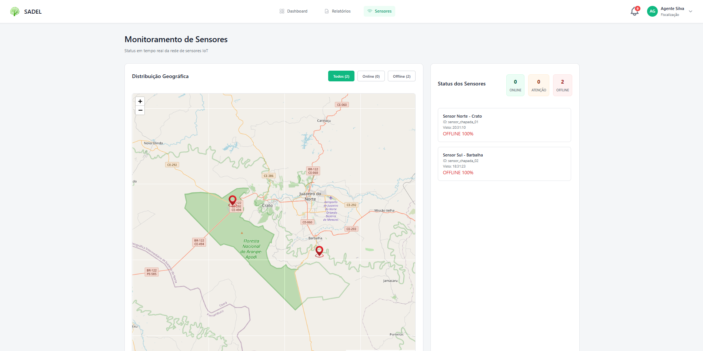
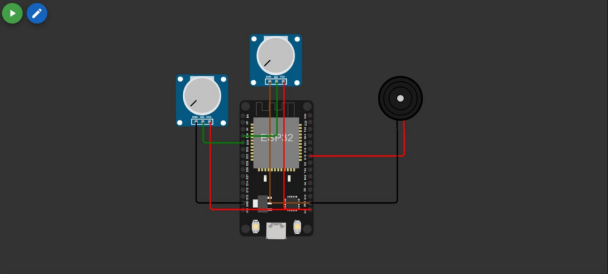

# 🌳 SADEL - Sistema de Alerta de Desmatamento Local 🔥

**Projeto acadêmico de monitoramento ambiental para a Chapada do Araripe.**

Desenvolvido por alunos de Análise e Desenvolvimento de Sistemas da UniFAP. O objetivo é um sistema de monitoramento e alerta de desmatamento e queimadas em tempo real.

---

### 🛠️ Tecnologias Utilizadas

**Hardware & IoT** 

-00979D?style=for-the-badge&logo=arduino&logoColor=white)

**Frontend & Dashboard** 

---

## ✨ Funcionalidades Principais

O sistema foi projetado para identificar riscos ambientais usando sensores simulados:

* 🔊 **Detecção de Som:** O protótipo usa um sensor (simulado por um potenciômetro) para identificar padrões sonoros que sugerem o uso de motosserras.
* 🔥 **Detecção de Queimadas:** Um segundo sensor monitora a fumaça e o gás no ambiente, ativando um alerta imediato em caso de risco de incêndio.
* ☁️ **Alerta em Tempo Real:** Ao detectar um risco, o sistema envia um pacote de alerta imediatamente para o banco de dados na nuvem (Firebase).
* 💓 **Monitoramento de Status:** Os sensores enviam um "sinal de vida" (heartbeat) a cada 30 segundos para confirmar que estão online.
* 🖥️ **Dashboard de Visualização:** Uma interface web consome os dados do Firebase e exibe os alertas recebidos visualmente.

---

## 📸 Galeria do Projeto

Abaixo estão algumas capturas de tela do funcionamento do sistema SADEL.

### Visão da Dashboard Web
*Interface onde os alertas de incêndio e desmatamento são mostrados em tempo real.*

  

  

  

### Simulação no Wokwi (IoT)
*O circuito ESP32 simulado, mostrando os sensores de gás e som.*

  

---

## 📂 Estrutura do Repositório

O projeto está organizado nas seguintes pastas:

* ` /dashboard/ ` - Contém os arquivos do frontend web (HTML, CSS, JS) para exibir os alertas.
* ` /sensor_norte/ ` - Projeto PlatformIO do **Sensor 1 (Crato)**. Inclui código-fonte (`src/main.cpp`) e diagrama.
* ` /sensor_sul/ ` - Projeto PlatformIO do **Sensor 2 (Barbalha)**. Inclui código-fonte (`src/main.cpp`) e diagrama.

---

## ⚠️ Aviso de Configuração Importante

Para que o projeto funcione, você **DEVE** fornecer suas próprias credenciais. Os arquivos de código foram enviados sem dados sensíveis por segurança.

1.  **Firmware (C++/Sensores):** Você precisará criar o arquivo `secrets.h` nas pastas de cada sensor e inserir suas credenciais de Firebase e Wi-Fi.
2.  **Dashboard (JS):** Você precisará substituir os placeholders (`SUA_API_KEY_AQUI`, etc.) nos arquivos JavaScript dentro da pasta `/dashboard/`.

---

## 👥 Autores

Projeto desenvolvido em colaboração por:

* **João Lucas Batista**
    * [LinkedIn](https://www.linkedin.com/in/jo%C3%A3olucasdev/)
    * [GitHub](https://github.com/joaolucasbatista)

    * **Evandio de Souza Filho**
    * [LinkedIn](https://www.linkedin.com/in/evandio-de-souza/)
    * [GitHub](https://github.com/evandiopds)

   
  

